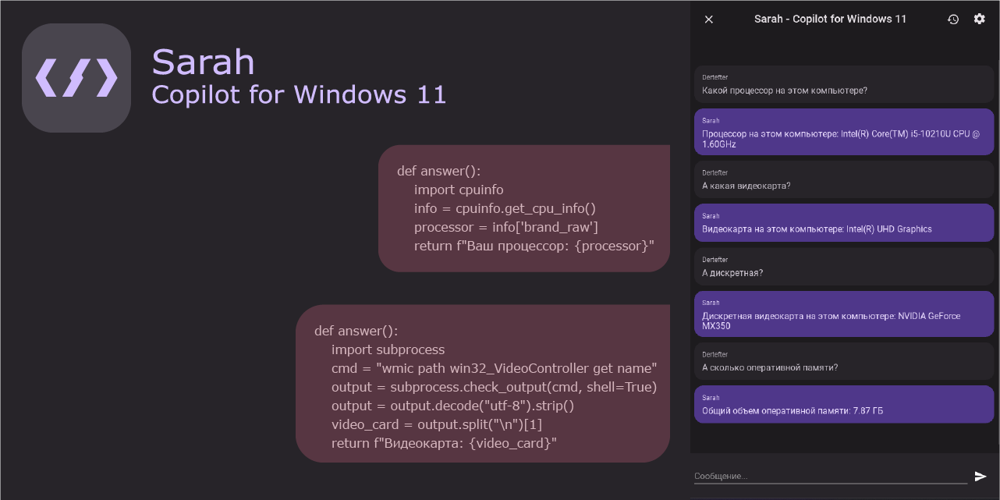
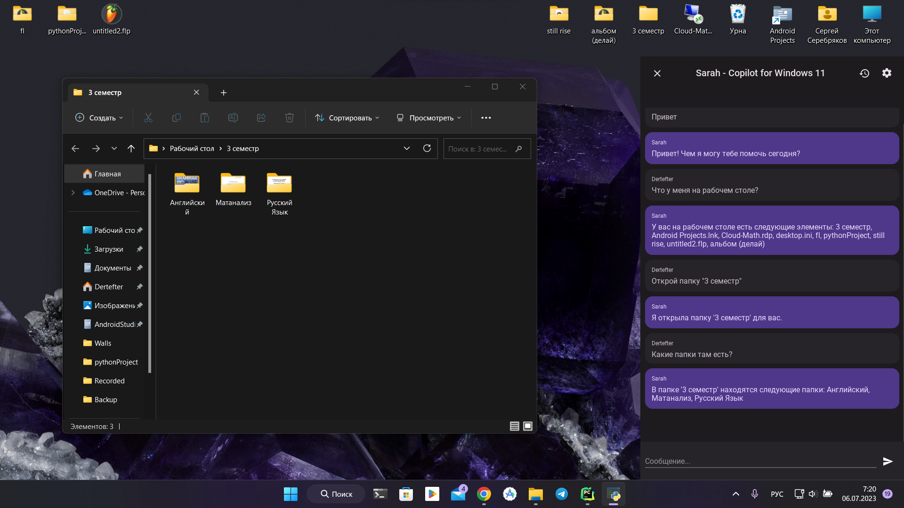
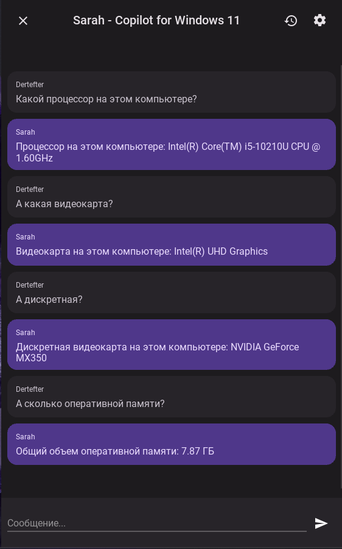

# Sarah - Copilot for Windows 11
[](README.md)

  



An attempt to create a Copilot for Windows. The project is based on [gpt4free](https://github.com/xtekky/gpt4free).

## Project Description

The project uses the gpt4free library to work with the ChatGPT model. If a simple text response is not sufficient, the program can generate Python code and then execute that code to obtain the result.

In fact, this approach allows ChatGPT to perform almost any task on your computer. For example, you can ask ChatGPT to open a website or a program, find out the exact time and date, or create and delete files.

> Important: The program has unpredictable behavior due to the characteristics of the ChatGPT model. Please exercise caution when interacting with it and do not trust it to perform any tasks that could harm your computer.

## Application Features

1. Interaction with ChatGPT: Users can ask questions or request specific tasks using text queries.
2. Code Compilation and Execution: The application recognizes code in the response from ChatGPT, saves it to the `execute.py` file, and executes the received code, displaying the execution result.
3. Voice Input: The application supports voice input after the activation phrase "Sarah". The [vosk](https://alphacephei.com/vosk/) library is used for voice processing. To use this feature, you need to download the models [here](https://alphacephei.com/vosk/models), unpack them to a convenient location, and specify the path to the model in the application settings.
4. Speech Synthesis: The application can vocalize the results using the Windows speech synthesizer.

## Installation
```
pip install -r requirements.txt
```

## Running
```
python main.py
```

## Screenshots
<div style="height: 50%">





</div>

## Important
> This project is created for educational purposes. The author is not responsible for your actions. Use it at your own risk.

## Acknowledgments
We would like to thank the following projects for their contributions to the development of this application:
* [gpt4free](https://github.com/xtekky/gpt4free)
* [vosk](https://alphacephei.com/vosk/)

## License
Distributed under the [MIT License](LICENSE.md)