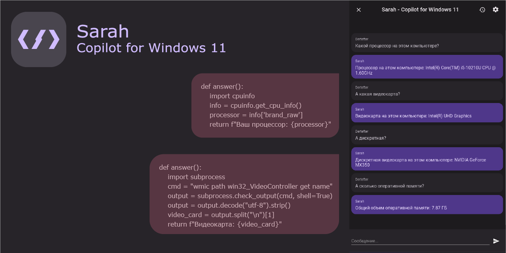
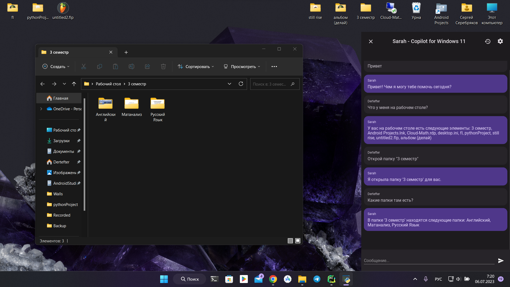
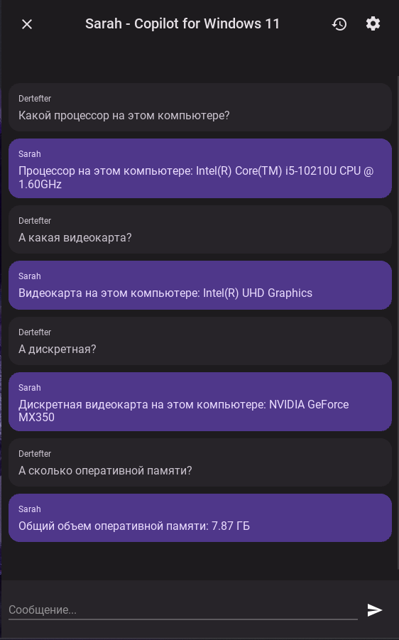
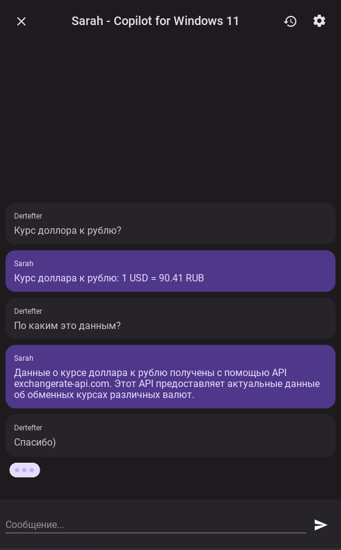

# Sarah - Copilot для Windows 11
[](README.ENG.md)

  


Попытка создания своего Copilot для Windows. Проект основан на [gpt4free](https://github.com/xtekky/gpt4free).

## Описание проекта

Проект использует библиотеку gpt4free, чтобы работать с моделью ChatGPT. Если простой текстовый ответ не является достаточным, программа может генерировать код на языке Python, а затем получать результат выполнения этого кода.

Фактически, такой подход позволяет ChatGPT выполнять практически любые задачи на вашем компьютере. Например, вы можете попросить ChatGPT открыть какой-либо сайт, программу, узнать точное время и дату, создать или удалить файл.

> Важно: Программа имеет непредсказуемый характер из-за особенностей работы модели ChatGPT. Пожалуйста, будьте осторожны при обращении с ней, и не доверяйте ей выполнение каких-либо задач, которые могут нанести вред вашему компьютеру.

## Функции приложения

1. Взаимодействие с ChatGPT: Пользователь может задавать вопросы или просить выполнить определенные задачи с помощью текстовых запросов.
2. Компиляция и выполнение кода: Приложение распознает код в ответе от ChatGPT, сохраняет его в файл `execute.py` и выполняет полученный код, выводя результат выполнения.
3. Голосовой ввод: Приложение поддерживает голосовой ввод после фразы активации "Сара". Для обработки голоса используется библиотека [vosk](https://alphacephei.com/vosk/). Для использования данной функции необходимо скачать модели [здесь](https://alphacephei.com/vosk/models), распаковать их в удобное для вас место и указать путь к модели в настройках приложения.
4. Озвучивание результатов: Приложение может озвучивать результаты с помощью синтезатора речи Windows.

## Установка и запуск
```
git clone https://github.com/dertefter/sarah_copilot
```
```
cd sarah_copilot
```
```
python -m venv venv
```
```
call venv\Scripts\activate.bat
```
```
pip install -r requirements.txt
```
```
python main.py
```

## Скриншоты
<div style="height: 50%">





</div>

## Важно
> Данный проект создан в ознакомительных целях. Автор не несёт ответственности за ваши действия. Используйте его на свой страх и риск.

## Благодарности
Мы благодарим следующие проекты за их вклад в разработку данного приложения:
* [gpt4free](https://github.com/xtekky/gpt4free)
* [vosk](https://alphacephei.com/vosk/)

## Лизцензия
Распространяется под лицензией [MIT](LICENSE.md)
