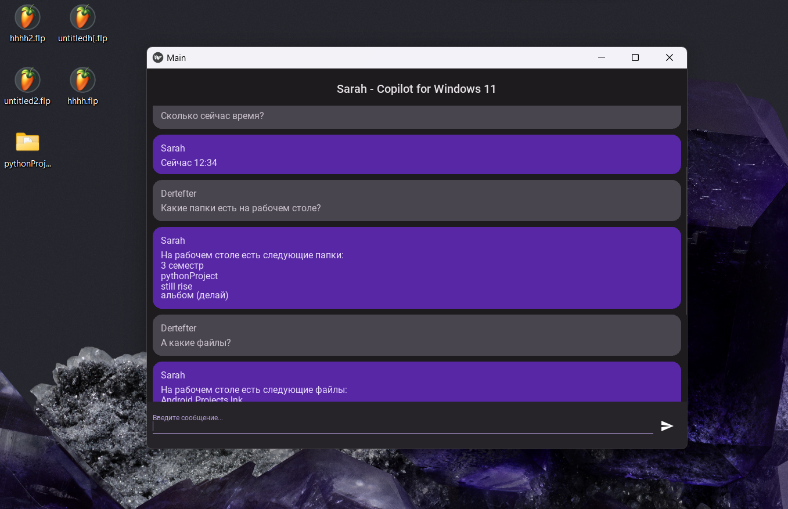

# Sarah - Copilot for Windows 11
Попытка создания собственного Copilot для Windows. Проект работает с помощью [gpt4free](https://github.com/xtekky/gpt4free). 
(Однако вы можете использовать API OpenAI, немного модернизировав файл mind.py)

Установка:
pip install requirements.txt

Запуск:
python main.py
